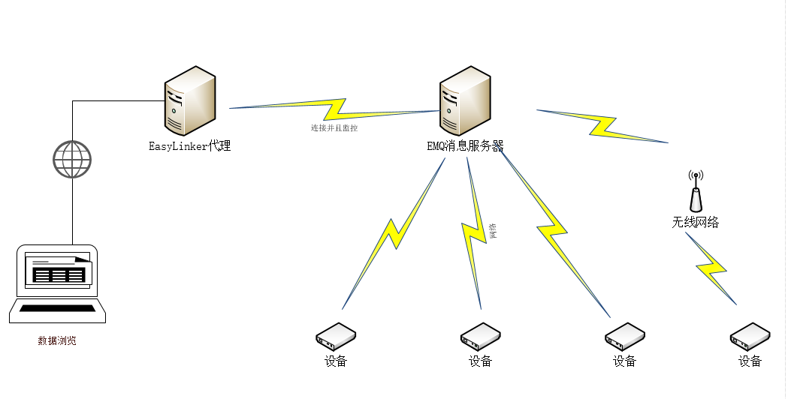

# EasyLinker V2.0
### 学习群：475512169
# 一些附件
>paho库
http:www.eclipse.org/paho/  
qmqtt:https://github.com/emqtt/qmqtt   
EMQ下载地址:http://emqtt.com/downloads
### 安装教程 :http://www.easylinker.xyz/t/4
### EasyLinker-EMQ : https://git.coding.net/ChildeWWH/EMQ_Easylinker.git
# 前言
 
>本人是电子信息工程理工科男一枚，标准技术宅。本应该去研究CPU架构和汇编语言的我，却迷上了WEB互联网开发。加上平时喜欢折腾一些极客玩具，渐渐的对硬件也来了兴趣。
平日里酷爱折腾一些极客玩具的我，再加上本人身处硬件相关专业，平时接触到了很多不一样的问题。问题总是围绕在身边。
比如，某同学在做STM32单片机的时候抱怨：“我要是把拿到的数据用软件存储起来就好了，到时候直接拿出来观察结果数据。”再者还有：“要是能把单片机的数据传输到网络里面就好了，可以随便查看。”
这些都是来自硬件工程师的抱怨和难处：硬件不负责数据的可视化呈现，他们更喜欢用各种仪器去查看。
我想：能否解决这个问题？让这些硬件工程师随时可以查看数据，用手机，用浏览器，APP，都可以观测结果，即打造一个“通用的平台，用来让硬件把数据传递到互联网。
于是自己着手试了一下，在很长的时间里，尝试了很多方法，也解决了一部分问题，但是总是不完美，
期间用了Python在树莓派上实现一个数据呈现平台，但是不理想，折腾许久，
最终决定用Java来实现这个平台。这就是这个项目的来源，含义就是：让一切联网变得更加容易.  
> 

# 新版特点

>  新版特点  
1.新版本全部采用REST接口形式形式，方便扩展;  
2.加入了Swagger-API插件动态显示文档的功能;  
3.增加设备管理器，随时查看设备的资源和状态;  
4.拟增加Node.js脚本支持，便于用户自定义策略;  
5.增加物理网常用API接口(天气，温度，湿度等等);   
6.附带一个微型博客，用户共享示例; 
7.附带一个APP来管理后台设备;
>
# 架构图  

#配置教程  
## EasyLinker配置  
application.properties配置
```aidl
###################################################################################################
#server
#####################################################################################################
server.port=1314
spring.http.encoding.charset=utf8
spring.http.encoding.force=true
spring.http.multipart.maxFileSize=10Mb
spring.http.multipart.maxRequestSize=10Mb
#开启对AOP的支持
spring.aop.auto=true
#设置代理模式 true（cglib） false(java JDK代理)
spring.aop.proxy-target-class=true
####################################################################################################
####################################################################################################
spring.datasource.driver-class-name=com.mysql.jdbc.Driver
spring.datasource.url=jdbc:mysql://localhost:3306/easylinker_dev?autoReconnect=true&useUnicode=true&characterEncoding=utf8&useSSL=true
spring.datasource.password=easylinker_dev
spring.datasource.username=easylinker_dev
spring.datasource.tomcat.validation-query=SELECT 1
spring.datasource.dbcp2.test-on-borrow=true
server.tomcat.uri-encoding=UTF-8
#####################################################################################################
#JPA Configuration:
#####################################################################################################
spring.jpa.database=MYSQL
spring.jpa.open-in-view=true
spring.jpa.show-sql=false
spring.jpa.generate-ddl=true
spring.jpa.hibernate.ddl-auto=update
######################################################################################################
###mail setting
######################################################################################################
spring.mail.host=smtp.qq.com
spring.mail.username=你的邮箱
spring.mail.password=密码（口令，非登录密码）
spring.mail.properties.mail.smtp.auth=true
spring.mail.properties.mail.smtp.starttls.enable=true
spring.mail.properties.mail.smtp.starttls.required=true
######################################################################################################
######################################################################################################
#EMQ server 请替换成自己的EMQ安装服务器
######################################################################################################
easylinker.emq.host=tcp://localhost
easylinker.emq.api.host=http://localhost:8080/api/v2/
easylinker.emq.api.user=admin
easylinker.emq.api.password=public
######################################################################################################
######################################################################################################
#又拍云（请换成自己的）
######################################################################################################
upyun.account.bucketname=bucketname
upyun.account.username=username
upyun.account.password=password
upyun.account.apiKey=apikey
######################################################################################################


```
## 2.EMQ配置  
acl.conf
```aidl 
%%--------------------------------------------------------------------
%%
%% [ACL](https://github.com/emqtt/emqttd/wiki/ACL)
%%
%% -type who() :: all | binary() |
%%                {ipaddr, esockd_access:cidr()} |
%%                {client, binary()} |
%%                {user, binary()}.
%%
%% -type access() :: subscribe | publish | pubsub.
%%
%% -type topic() :: binary().
%%
%% -type rule() :: {allow, all} |
%%                 {allow, who(), access(), list(topic())} |
%%                 {deny, all} |
%%                 {deny, who(), access(), list(topic())}.
%%
%%--------------------------------------------------------------------
{allow, all, subscribe, ["$SYS/brokers/+/clients/+/connected","$SYS/brokers/+/clients/+/disconnected"]}.
%%{allow, all, subscribe, ["$SYS/#", "#"]}.
%%{allow, all, subscribe, ["$SYS/#", {eq, "#"}]}.
%%{allow, all, subscribe, ["#"]}.
```
emq_auth_mysql.conf(数据库信息改成你自己的)
```aidl
##--------------------------------------------------------------------
## MySQL Auth/ACL Plugin
##--------------------------------------------------------------------

## MySQL Server 3306, 127.0.0.1:3306, localhost:3306
auth.mysql.server = 127.0.0.1:3306
## Mysql Pool Size
auth.mysql.pool = 8
## Mysql Username
auth.mysql.username =easylinker_dev
## Mysql Password
auth.mysql.password =easylinker_dev
## Mysql Database
auth.mysql.database = easylinker_dev

auth.mysql.auth_query = select open_id as password from device where open_id = '%u' limit 1
auth.mysql.password_hash = plain
auth.mysql.acl_query = select allow , ip_address, open_id AS username , client_id AS clientid , access, topic from device  where  open_id ='%u'
```
emq.conf(这两处修改为以下值)
```aidl
mqtt.allow_anonymous = false
mqtt.acl_nomatch = allow
```
##启动方式
```aidl
# 启动emqttd
./bin/emqttd start

# 检查运行状态
./bin/emqttd_ctl status

# 停止emqttd
./bin/emqttd stop
```
# 客户端连接代码DEMO
## 1.Python客户端代码示例(控制树莓派40号引脚的电平)
```
#说明：需要安装paho-mqt库,命令:pip install paho-mqtt
#[8305132bc868fa613dfa2fa3eac6053a] 这个是设备的openId
import RPi.GPIO as GPIO
import paho.mqtt.client as mqtt
import time
GPIO.setmode(GPIO.BOARD)
GPIO.setup(40, GPIO.OUT)

def on_connect(client, userdata, flags, rc):
    print("Connected Success! "+str(rc))
    client.subscribe("device/8305132bc868fa613dfa2fa3eac6053a")
    file = open("/sys/class/thermal/thermal_zone0/temp")
    temp = float(file.read()) / 1000
    data={ "qos":1, "retain":"true","unit":"C", "message":str(temp)}
    client.publish("device/8305132bc868fa613dfa2fa3eac6053a", str(data))     
    file.close()
    time.sleep(6)

def on_message(client, userdata, msg):
    print("received:"+str(msg.payload))
    if(str(msg.payload)=="ON"):
        GPIO.output(40, GPIO.LOW)
    elif(str(msg.payload)=="OFF"):
        GPIO.output(40, GPIO.HIGH)

client = mqtt.Client("8305132bc868fa613dfa2fa3eac6053a")
client.on_connect = on_connect
client.on_message = on_message
client.username_pw_set("8305132bc868fa613dfa2fa3eac6053a","8305132bc868fa613dfa2fa3eac6053a")
client.connect("192.168.3.64", 1883, 60)
client.loop_forever()
```


